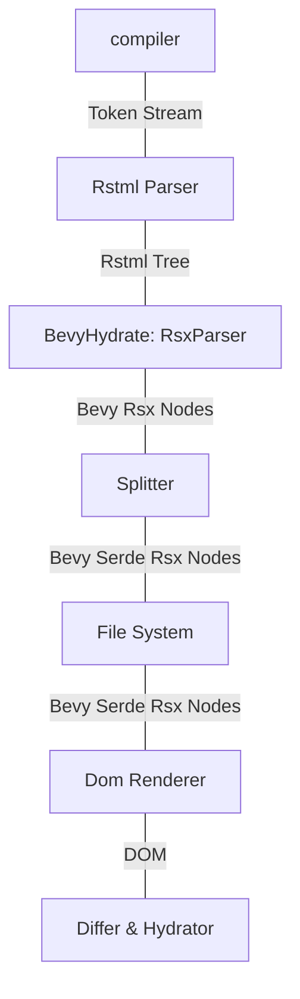
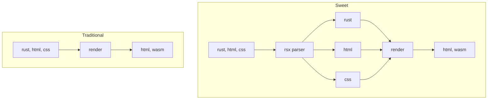

```rust


Tree<RsxNode<BevyHydrate>>
Tree<SerdeRsxNode<BevyHydrate>>
```






The interactivity layer is a very lightweight layer over the leptos `reactive_graph` signals crate.

The hydration strategy is loosely borrowed from quik. Html serialization and lazy event patching allow for html-rust splitting and zero pre-hydration events missed.

The opinions on client-server relationship, routing are very astro, as is the integrations layer for crates like axum, leptos or bevy. 


## The Preprocessor

The sweet preprocessor is a binary downloaded via `cargo binstall sweet-cli` that watches rust files and extracts the html with some metadata.


I havent come across this in the rust ecosystem before so its probably worth clarifying what i mean by a rust preprosser.

## What it does

The preprocessor literally splits rsx components into a html and a rust file, and only recompiles if the rust file hash changes. 

 stores the rsx block locations as html attributes and lazily hooks them up to the wasm code.

Naturally any changes outside of the

```rust

let (value,set_value) = signal();

rsx!{
	<div>the {val}th value is {val}</div>
	<button onclick={|e|val += 1}>increment</button>
}
```
Will be serialized by as this html
```html
<button onclick="_sweet.event(0,event)">increment</button>
<div data-sid="0" data-sblock="4,6,18">the 11th value is 11</div>
```
And this rust
```rust
Hydrated {
	events: vec![Box::new(handle_click)],
	blocks: vec![
		HydratedBlock {
			node_id: 0,
			part_index: 1,
		},
		HydratedBlock {
			node_id: 0,
			part_index: 3,
		},
	],
}
```


These four numbers are all thats required